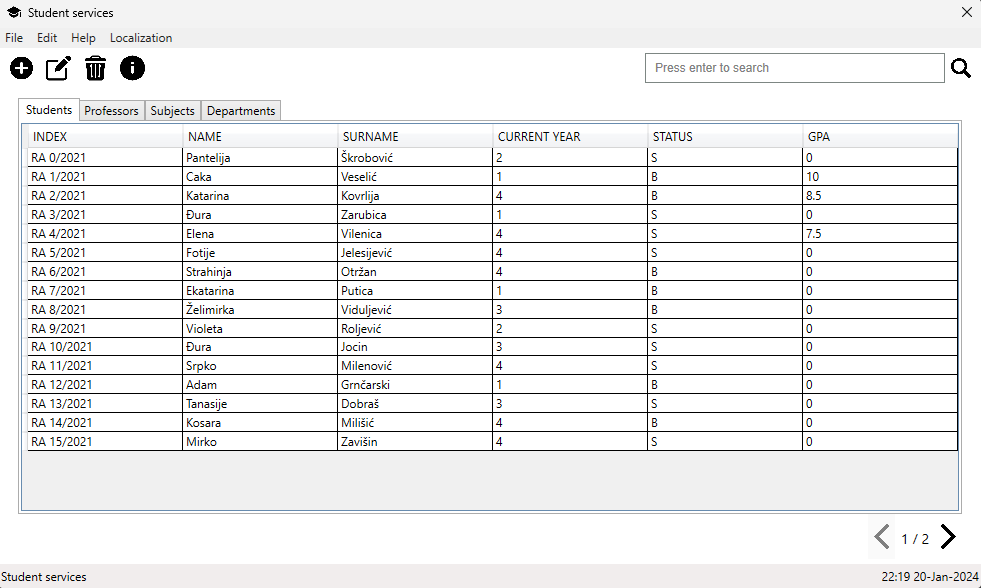
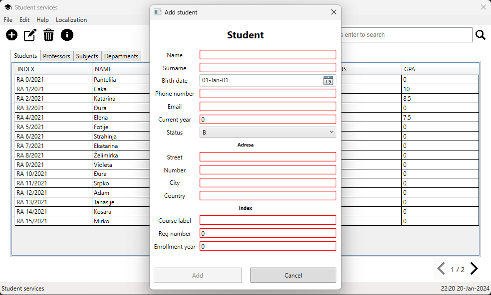
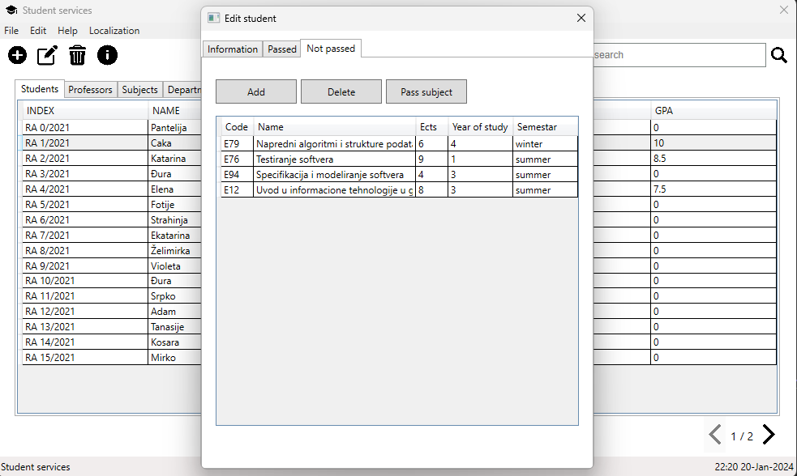
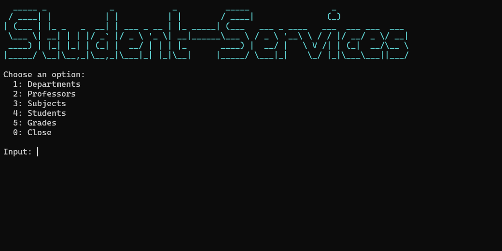

# Student-Services project (group-1-team-1)

This project was done for the course *The Fundamentals of Information Systems and Software Engineering*

Full specification can be found on the following [link](https://docs.google.com/document/d/1Vvs8RM9YwzmJLRbPBSyDS3UXAFOEhiJ8e_dv84Fyq_I/edit)

## App screenshots

### GUI

### CLI

# About

Team members:

* Nemanja Zekanovic RA 73/2021
* Nikola Kuslakovic RA 8/2021